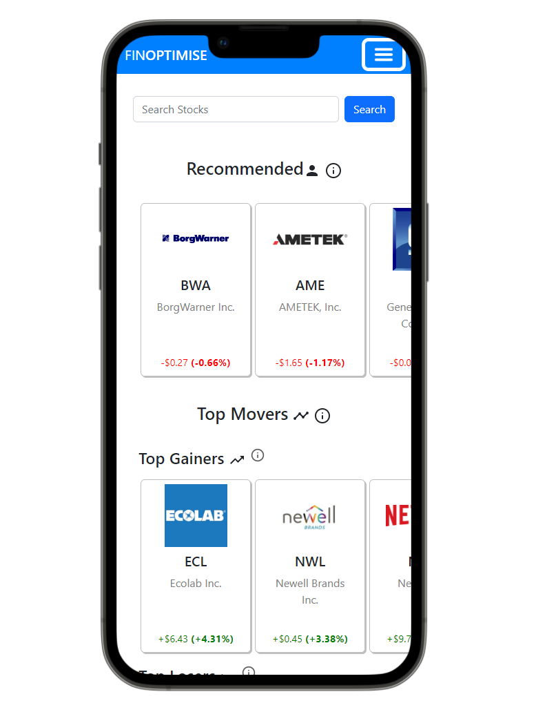

<!-- Project Title -->
# FinOptimise

<!-- PROJECT LOGO -->
 

  

  

    <a href="https://github.com/DaraghK93/stockApp"><strong>Explore the GitHub Repo »</strong></a>
     
    <a href="https://master.d2l3aeky8jssr5.amplifyapp.com/"><strong>Visit the Site »</strong></a>
  

## Table of Contents

  
Cllick to Expand

  <ol>
    <li>
      <a href="#about">About The Project</a>
      <ul>
        <li><a href="#core-features">Core Features</a></li>
        <li><a href="#other-features">Other Features</a></li>
      </ul>
    </li>
    <li><a href="#built-with">Built With</a></li>
    <li><a href="#contributors">Contributors</a></li>
    <li><a href="#contact">Contact</a></li>
  </ol>

---

<!-- ABOUT -->
## About 
FinOptimise is a fantasy stock trading game. Experience the stock market risk free. Learn about healthy investing habits. Research stocks to get ahead. Compete with friends in game leagues with customisable rules.
### Core Features:

  
  <h3>Create or Join a Game</h3>
  
Create or join a game with fully customisable rules or create one with out of the box rules.

    
  <h3>Explore Stocks</h3>
  
Explore stocks with personalised recommendations

    
  <h3>Research the Best Stocks to Trade</h3>
  
Research the best stocks to trade using our advanced A.I. tools

    
  <h3>Compete Against Your Friends</h3>
  
Compete against friends and see where you stand in real time with our game leaderboards

### Other Features:

  
  <h3>Company specific news feeds</h3>
  
Use our in-built company specific news feeds from a range of publications to keep up to date with companies and get an advantage over other players in the league.

    
  <h3>Sentiment Analysis</h3>
  
Use our sentiment analysis tools to see the whether the current sentiment of a company is Positive, Negative or Neutral both on Twitter and across our News Feed.

    
  <h3>Ethical Investing</h3>
  
Use our clear and easy to understand ESG Ratings to help you learn how to invest ethically.

    
  <h3>Learn About the Basics</h3>
  
Use our education section to read about the basics of investing and to find more resources for further reading/watching. Use that newfound knowledge to get the upper hand in your league!

---

## Built With

This application was built on the MERN stack and deployed using AWS Amplify.
#### <ins>Development Tools/Technologies:</ins>
[![MongoDB][Mongodb.com]][Mongodb-url]
[![Express][Expressjs.com]][Express-url]
[![React][React.js]][React-url]
[![React Bootstrap][Bootstrap.com]][Bootstrap-url]
[![NodeJS][NodeJS.org]][NodeJS-url]

#### <ins>Deployment Tools/Services:</ins>
* [AWS][AWS-url]
* [AWS Amplify](https://aws.amazon.com/amplify/)
* [AWS Lambda](https://aws.amazon.com/lambda/)
* [AWS SAM](https://aws.amazon.com/serverless/sam/)
* [AWS API Gateway](https://aws.amazon.com/api-gateway/)
* [AWS Parameter Store](https://docs.aws.amazon.com/systems-manager/latest/userguide/systems-manager-parameter-store.html)
* [Docker](https://www.docker.com/)

---

<!-- Contributors / Dev Team -->
## Contributors
| Name            | GitHub                            | LinkedIn                             |
|-----------------|-----------------------------------|--------------------------------------|
| Bearach Byrne   | https://github.com/BearachB       | https://www.linkedin.com/in/bearach/ |
| Joseph Corcoran | https://github.com/joeycor92      | -                                    |
| Warren Kavanagh | https://github.com/WarrenK-design | -                                     |
| Rebecca Kelly   | https://github.com/beckskelly     | -                                    |
| Daragh Kneeshaw | https://github.com/DaraghK93/     | -                                    |
| Caolán Power    | https://github.com/caolan-power   | -                                    |

(<a href="#table-of-contents">back to top</a>)

---

<!-- CONTACT -->
## Contact

FinOptimise Development Team - finoptimisetud@gmail.com

Project Link: [https://github.com/DaraghK93/stockApp](https://github.com/DaraghK93/stockApp)

<!-- MARKDOWN LINKS & IMAGES -->
<!-- https://www.markdownguide.org/basic-syntax/#reference-style-links -->

<!-- Images -->

<!-- Icons -->
[Mongodb.com]: https://img.shields.io/badge/MongoDB-4EA94B?style=for-the-badge&logo=mongodb&logoColor=white
[Mongodb-url]: https://www.mongodb.com/home

[Expressjs.com]: https://img.shields.io/badge/Express.js-404D59?style=for-the-badge
[Express-url]: https://expressjs.com/

[React.js]: https://img.shields.io/badge/React-20232A?style=for-the-badge&logo=react&logoColor=61DAFB
[React-url]: https://reactjs.org/

[Bootstrap.com]: https://img.shields.io/badge/Bootstrap-563D7C?style=for-the-badge&logo=bootstrap&logoColor=white
[Bootstrap-url]: https://react-bootstrap.github.io/

[NodeJS.org]: https://img.shields.io/badge/Node.js-43853D?style=for-the-badge&logo=node.js&logoColor=white
[NodeJS-url]: https://nodejs.org/en/

[AWS.com]: https://img.shields.io/badge/Amazon_AWS-232F3E?style=for-the-badge&logo=amazon-aws&logoColor=white
[AWS-url]: https://aws.amazon.com/